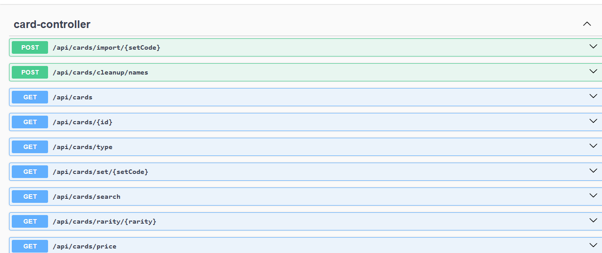

MagicSearch: Advanced MTG Data Engine & REST API
Descrizione del Progetto : MagicSearch è un'applicazione Back-End professionale sviluppata con Java 21 e Spring Boot 3.5. Il sistema implementa una pipeline ETL (Extract, Transform, Load) completa per digitalizzare i dati di Magic: The Gathering dalle API ufficiali di Scryfall in un database locale MySQL altamente ottimizzato.

1 PUNTI DI FORZA E INNOVAZIONI TECNOLOGICHE
Modern Java Stack: Sviluppato con Java 21 e Spring Boot 3.5.11.
Interactive API Docs (Swagger): Integrazione nativa con SpringDoc OpenAPI per testare gli endpoint in tempo reale.
Reactive Networking: Utilizzo di WebFlux (WebClient) con buffer a 10MB per gestire payload JSON massivi.
Data Quality & Unicode Sanitization: Sistema di pulizia integrato (CardNameCleanupService) per risolvere anomalie Unicode (\u00A0).
Smart Rate Limiting: Delay di 110ms per rispettare le policy di Scryfall (max 10 req/sec).

2 STACK TECNOLOGICO
| Tecnologia | Modulo Maven | Utilizzo |
| **Java 21** | java.version| Performance e gestione moderna delle stringhe. |
| **Spring Boot 3.5** | spring-boot-starter-parent | Framework core e architettura a layer. |
| **WebFlux** | spring-webflux | Client HTTP reattivo per l'importazione dati. |
| **Swagger UI** | springdoc-openapi| Interfaccia grafica per il testing delle API. |
| **MySQL 8.0** | mysql-connector-j | Database relazionale con supporto Unicode. |

3 API ENDPOINTS (Documentazione Completa)
Una volta avviata l'applicazione, la console interattiva è disponibile qui:
->  http://localhost:8080/swagger-ui/index.html

Metodi di Lettura (GET)Questi endpoint interrogano il database locale e restituiscono oggetti JSON.

Tutte le carte : http://localhost:8080/api/cards -> Ritorna la lista completa di tutte le carte salvate.

Singola carta per ID : http://localhost:8080/api/cards/{id} -> Cerca una carta tramite il suo ID univoco Scryfall (es 02fb5f9f-8750-4eb5-a03a-6dacc60e0b90).

Ricerca per Nome : http://localhost:8080/api/cards/search?name={nome} -> Ricerca di una carta parziale e case-insensitive in base al suo nome (es. ?name=Venerated rotpriest, o venerated).

Filtro per Rarità :  http://localhost:8080/api/cards/rarity/{rarity} -> Filtra carte in base alle sue rarità (es. common, uncommon, rare, mythic).

Filtro per Set : http://localhost:8080/api/cards/set/{setCode} -> Filtra carte  per codice del set (es. dsk, mkm, one,ecc).

Filtro per Tipo : http://localhost:8080/api/cards/type?typeLine={tipo} -> Cerca per tipo di carte (es. ?typeLine=Creature,?typeLine=Enchantment,?typeLine=Sorcery,ecc).

Filtro per Colore : http://localhost:8080/api/cards/color?color={codice} -> Supporta colori singoli per carte (W=White, U=blue, B=Black, R=Red, G=Green) o combinazioni di colori per carte multicolore separate da virgola (es. R,W Per le carte multicolore  rosse e bianche), nota bene: la ricerca segue l'ordine standard dei colori (W,U,B,R,G). Cercare R,W restituirà risultati solo se i colori sono stati salvati in quell'ordine specifico.

Filtro per Prezzo : http://localhost:8080/api/cards/price?maxPrice={valore} -> ": Prende solo le carte che costano quanto o meno della cifra indicata ($prezzo \le 10.50$).Pulizia dei Dati (Null Check): Scarta automaticamente tutte le carte che non hanno un prezzo assegnato (molte carte promozionali o rarissime su Scryfall hanno il campo prezzo vuoto). Questo evita di mostrare risultati "sporchi".Ordinamento per Rilevanza: Ordina i risultati dal più caro al più economico (DESC). Questo è utilissimo perché l'utente che cerca carte "fino a 10€" di solito è interessato a vedere prima le carte che valgono vicino a 10€, non quelle da 0.02€.

4 DATABASE E PERSISTENZA
Il progetto include una cartella database  contenente lo script magic.sql.
Setup Manuale: Lo script crea la struttura delle tabelle ottimizzata per simboli speciali (utf8mb4_unicode_ci).
Performance: Il filtraggio dei prezzi è ottimizzato lato database tramite query custom per ridurre il carico sulla JVM.

5 SETUP e installazione
(IDE-Independent)
Il progetto è configurato con Maven, il che permette di compilarlo ed eseguirlo su qualsiasi macchina (Windows, Mac, Linux) senza la necessità di un IDE (come Eclipse o IntelliJ).

(1)Prerequisiti

Java 21 (JDK) installato.

Maven 3.x installato.

MySQL 8.0 attivo e funzionante.

(2)Configurazione Database

Crea uno schema chiamato Magic_db.

Esegui lo script SQL che trovi nel progetto: /database/magic.sql.

Modifica il file src/main/resources/application.properties con il tuo username e password di MySQL.

(3)Avvio da Terminale (Bash/CMD)

Apri il terminale nella cartella principale del progetto ed esegui:

Bash

mvn clean install (Pulisce i vecchi file e scarica le dipendenze dal pom.xml)

mvn spring-boot:run  (avvia l'applicazione Spring Bott immediatamente)

🖥️ Anteprima Interfaccia Swagger UI
Ecco come appare la documentazione interattiva generata automaticamente, che permette di testare gli endpoint in tempo reale:

Autore: Cristian Bruno

